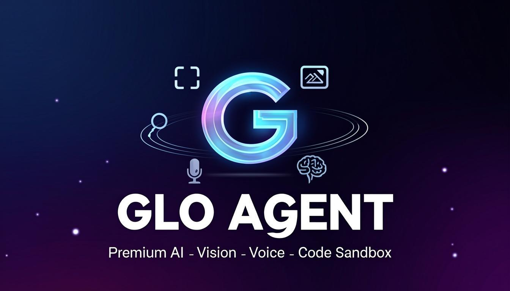
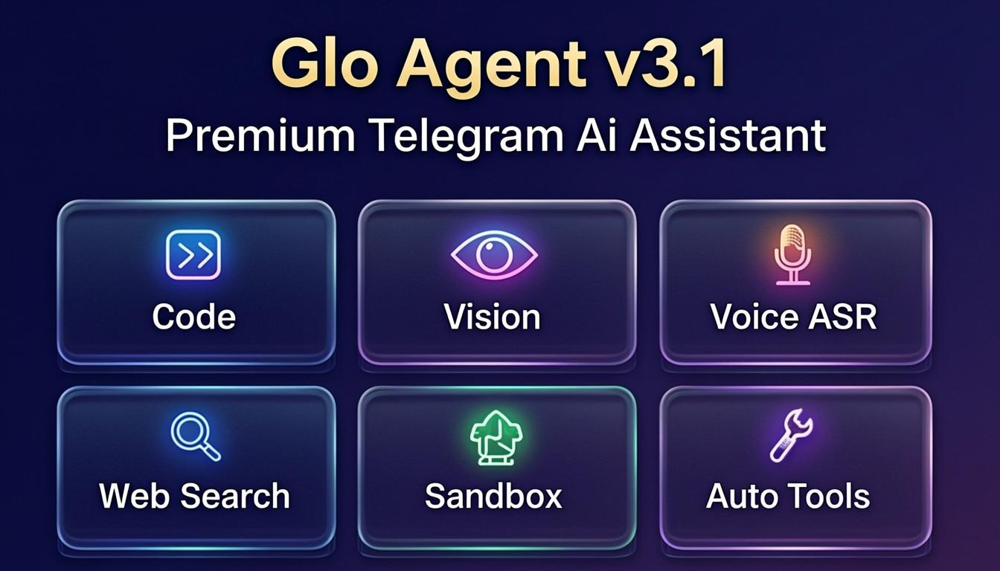
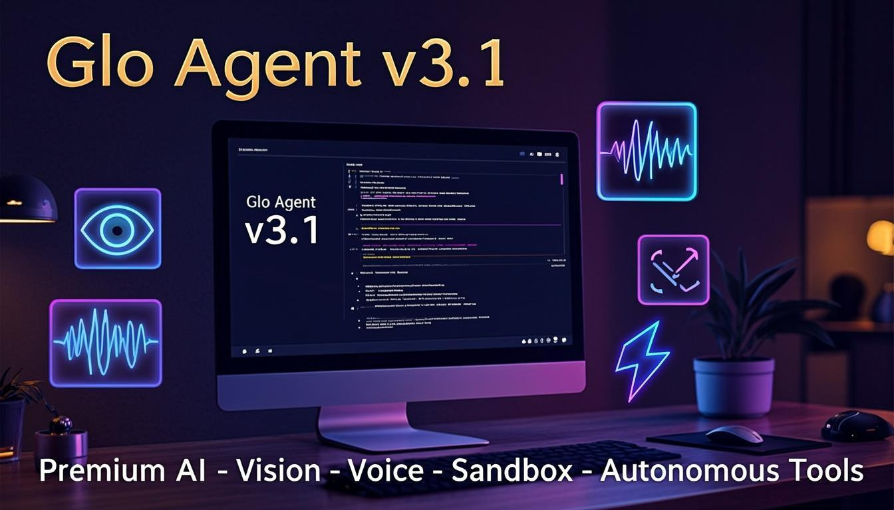
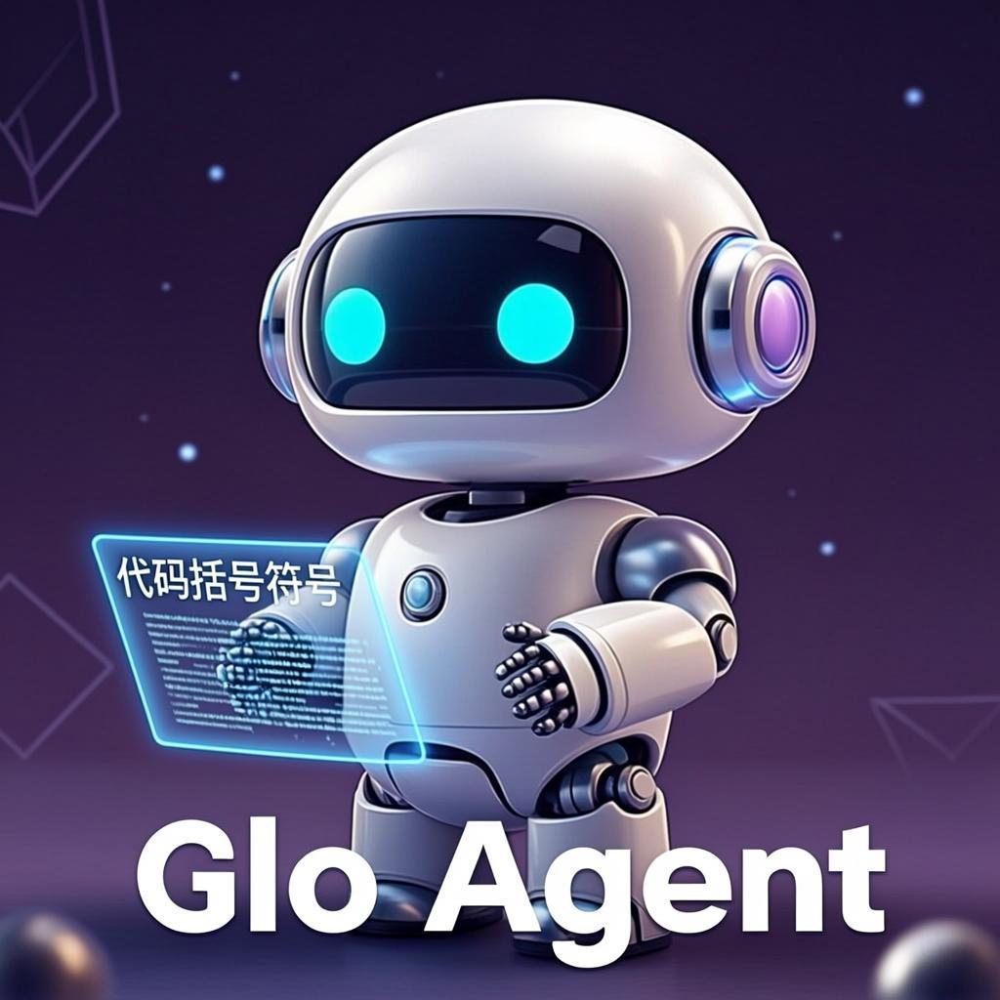

<div align="center">

# ✨ Glo Agent v3.1

**Premium Telegram AI Agent** — Vision • Voice • Web Search • Code Sandbox • Autonomous Tools



[](https://railway.app/new?template=https://github.com/Stonepath-dotcom/telegram-ai-agent&envs=BOT_TOKEN&BOT_TOKENDesc=Your+Telegram+Bot+Token+from+@BotFather)
[](https://github.com/Stonepath-dotcom/telegram-ai-agent)
[](https://groq.com)
[](LICENSE)

</div>

---

## 🎨 Brand Assets

| Banner | Use Case |
|--------|----------|
|  | **Hero dark** — README banner, landing page |
|  | **Feature grid** — Showcase all 6 premium features |
|  | **Cinematic promo** — Social media, blog posts |
|  | **Mascot** — Avatar, profile pic, splash screen |

---

## ✨ Fitur v3.1

### 🧠 Intelligence
- 📝 **Generate Kode** — Buat kode dari deskripsi dalam bahasa apapun
- 🐛 **Debug Kode** — Temukan dan perbaiki bug otomatis
- 🔍 **Code Review** — Analisis kualitas, keamanan, dan performa kode
- 📖 **Jelaskan Kode** — Penjelasan step-by-step untuk kode yang kompleks
- 💬 **Chat AI** — Diskusi tentang programming dan teknologi (streaming for premium)
- 🧭 **Multi-model Routing** — Query simple → fast model, complex → primary model

### 🚀 Premium v3 Features
- 🖼️ **Vision** — Kirim foto/file gambar, auto-analisa AI (Groq llama-4-scout)
- 🎤 **Voice ASR** — Voice note → text via Groq Whisper → AI response
- 🔊 **TTS** — Text-to-speech output
- 🌐 **Web Search** — DuckDuckGo (free) + Tavily/Serper optional
- 🧠 **Long-term Memory** — Bot inget preferensi & facts antar session
- ⚡ **Streaming Response** — Real-time typing animation (premium)
- 💎 **Premium Tier** — Free quotas + unlimited for premium users
- 🔍 **Inline Mode** — `@bot query` dari chat mana saja

### 🔥 NEW v3.1 Features
- 💻 **Code Sandbox** — `/run <lang> <code>` eksekusi kode di Judge0 CE (30+ bahasa, free, no API key)
- 🤖 **Autonomous Tool Calling** — `/ask <pertanyaan>` AI otomatis panggil `run_code` atau `web_search`
- 🎯 **Natural Language Trigger** — Ketik "run kode ini:" + code block → langsung dieksekusi

### 🛠️ Core
- 🔄 **Mode Percakapan** — Switch antara mode coding, debug, review, dll
- 🎛️ **Custom Branded Keyboard** — Navigasi premium dengan tombol interaktif
- 📎 **File Upload** — Kirim file kode/gambar langsung untuk di-review
- 🕐 **Context Memory** — Mengingat konteks percakapan
- 🛡️ **Rate Limiting** — Proteksi dari spam/abuse
- 🔍 **/aistatus** — Diagnostik konfigurasi AI + live connection test

---

## 🚀 Quick Deploy

### One-Click Deploy ke Railway

1. Klik tombol deploy di atas
2. Set `BOT_TOKEN` dengan token dari @BotFather
3. Set `AI_PROVIDER=groq` dan `AI_API_KEY=gsk_...` (dari https://console.groq.com/keys)
4. Deploy! Bot langsung jalan 24/7 🎉

### Manual Deploy

```bash
# Clone repo
git clone https://github.com/Stonepath-dotcom/telegram-ai-agent.git
cd telegram-ai-agent

# Install dependencies
npm install

# Set environment variables
export BOT_TOKEN=your_telegram_bot_token_here
export AI_PROVIDER=groq
export AI_API_KEY=gsk_your_groq_key_here

# Jalankan bot
npm start
```

---

## 🛠️ Commands

### Core Commands
| Command | Deskripsi | Contoh |
|---------|-----------|--------|
| `/start` | Welcome message + branded menu | `/start` |
| `/help` | Panduan lengkap | `/help` |
| `/code` | Generate kode | `/code buat REST API Express.js` |
| `/review` | Review kualitas kode | `/review <paste kode>` |
| `/debug` | Debug kode yang error | `/debug <kode> \| ERROR: <pesan>` |
| `/explain` | Jelaskan kode | `/explain <paste kode>` |
| `/chat` | Mode chat biasa (streaming for premium) | `/chat jelaskan tentang React hooks` |
| `/mode` | Ganti mode percakapan | `/mode code` |
| `/clear` | Hapus riwayat chat | `/clear` |

### Premium v3 Commands
| Command | Deskripsi |
|---------|-----------|
| `/search <query>` | Web search real-time (DuckDuckGo default) |
| `/image <prompt>` | Analisa gambar via AI vision |
| `/voice` | Voice ASR help |
| `/tts <teks>` | Text-to-speech output |
| `/memory` | Lihat & kelola long-term memory |
| `/tier` | Cek tier & kuota kamu |
| `/mystats` | Statistik penggunaan |
| `/aistatus` | Cek konfigurasi AI & test koneksi |

### 🔥 NEW v3.1 Commands
| Command | Deskripsi | Contoh |
|---------|-----------|--------|
| `/run <lang> <code>` | Eksekusi kode di sandbox (30+ bahasa) | `/run python\nprint("hello")` |
| `/ask <pertanyaan>` | AI agent otonom dengan tools | `/ask hitung fibonacci ke-30 pakai python` |

**Bahasa sandbox yang didukung:** Python, JavaScript, TypeScript, Go, Rust, C, C++, Java, Ruby, PHP, Bash, SQL, C#, Kotlin, Swift, Haskell, Lua, Perl, R, Scala, Dart, Elixir, Clojure, F#, OCaml, COBOL, D, Erlang, Fortran, Groovy, Nim, Octave, Pascal, Prolog, Scheme, Visual Basic.

---

## 💎 Premium Tier

| Feature | Free | Premium |
|---------|------|---------|
| 💬 Messages | 50/day | ∞ |
| 👁️ Vision | 5/day | ∞ |
| 🔍 Search | 10/day | ∞ |
| 🎤 Voice ASR | 5/day | ∞ |
| 🔊 Voice TTS | ❌ | ∞ |
| 💻 Sandbox | 10/day | ∞ |
| 🤖 Tool Chat | 15/day | ∞ |
| ⚡ Streaming | ❌ | ✅ |
| 🧠 Primary Model | ❌ (fast only) | ✅ |

**Aktifkan premium:** Set env var `PREMIUM_USER_IDS=<telegram-id-kamu>` di Railway.
Cek ID kamu di `@userinfobot`.

---

## 🐳 Docker Deployment

```bash
cp .env.example .env
# Edit .env dan set BOT_TOKEN + AI_PROVIDER + AI_API_KEY
docker-compose up -d
```

---

## ⚙️ Environment Variables

### Wajib
| Variable | Deskripsi | Contoh |
|----------|-----------|--------|
| `BOT_TOKEN` | Telegram Bot Token | `8990451027:AAHxxx...` |
| `AI_PROVIDER` | Provider AI | `groq` |
| `AI_API_KEY` | API key provider | `gsk_xxx...` |

### Opsional — Lihat DEPLOYMENT.md untuk full reference
- `AI_MODEL`, `AI_VISION_MODEL`, `AI_FAST_MODEL` — Override model
- `PREMIUM_USER_IDS`, `ADMIN_USERS` — Premium gating
- `TAVILY_API_KEY`, `SERPER_API_KEY` — Search provider upgrade
- `SANDBOX_BACKEND`, `SANDBOX_API_URL`, `SANDBOX_TIMEOUT` — Code sandbox config
- `MAX_TOKENS`, `TEMPERATURE`, `MAX_HISTORY`, `HISTORY_TTL`, `RATE_LIMIT` — Tuning

---

## 📁 Project Structure

```
telegram-ai-agent/
├── src/
│   ├── index.js              # Main entry point + command registration
│   ├── commands/index.js     # All command handlers (/code /run /ask /search ...)
│   ├── handlers/
│   │   ├── message.handler.js  # Text, photo, voice, document handlers
│   │   └── callback.handler.js # Inline button + inline query handlers
│   ├── services/
│   │   ├── ai.service.js        # Multi-provider AI (Groq/OpenAI/OpenRouter/Together)
│   │   ├── sandbox.service.js   # Code execution (Judge0 CE + Wandbox fallback)
│   │   ├── web-search.service.js # DuckDuckGo + Tavily + Serper
│   │   ├── voice.service.js     # Groq Whisper ASR + Z.ai TTS
│   │   ├── file.service.js      # File routing (text/image/binary)
│   │   ├── memory.service.js    # Long-term memory (JSON-backed)
│   │   ├── premium.service.js   # Tier gating + quota tracking
│   │   ├── history.service.js   # Conversation history
│   │   └── rate-limit.service.js # Anti-spam
│   └── utils/
│       ├── formatter.js        # Message formatting + splitMessage
│       └── keyboards.js        # Custom branded keyboards
├── config/default.js          # Configuration
├── docs/banners/              # 🎨 Brand banner assets
├── Dockerfile                 # Docker image
├── docker-compose.yml         # Docker Compose
├── ecosystem.config.cjs       # PM2 config
└── package.json
```

---

## 📝 License

MIT License - Free to use and modify!

---

<div align="center">

**Made with ✨ by [Stonepath-dotcom](https://github.com/Stonepath-dotcom)**

</div>
